<div align="center">

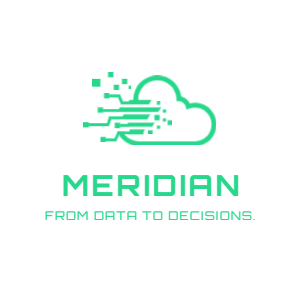

# 🌐 MERIDIAN

### Multi-Source AI Decision Assistant

_MERN + TypeScript · Agentic Orchestration · Multi-DB Reasoning_

[](https://www.typescriptlang.org/)
[](https://reactjs.org/)
[](https://nodejs.org/)
[](https://www.mongodb.com/)
[](https://expressjs.com/)

[](LICENSE)
[](http://makeapullrequest.com)

---

**MERIDIAN** is an advanced, production-grade chatbot system that connects to multiple heterogeneous data sources (Jira, MongoDB, ATS, Slack, etc.), unifies entities across them, and answers high-stakes decision queries with **ranked, explainable recommendations** instead of simple Q&A.

> 💡 Think of it as an **intelligent data fabric + reasoning layer** you query via chat.

[🎯 Problem](#-problem--motivation) • [🚀 Features](#-what-meridian-does) • [🏗️ Architecture](#-high-level-architecture) • [⚙️ Setup](#-setup) • [📍 Roadmap](#-feature-breakdown)

</div>

---

## 📑 Table of Contents

- [🎯 Problem & Motivation](#-problem--motivation)
- [🚀 What MERIDIAN Does](#-what-meridian-does)
- [💡 Why It's Novel](#-why-its-novel--patent-worthy)
- [🏗️ High-Level Architecture](#-high-level-architecture)
- [⭐ Core Features](#-core-features-mvp-scope)
- [🗄️ Data Model](#-data-model-mongodb--sketch)
- [🖥️ Backend Responsibilities](#-backend-responsibilities)
- [🎨 Frontend Responsibilities](#-frontend-responsibilities)
- [📍 Feature Breakdown](#-feature-breakdown-student--mvp-scope)
- [📜 What's Patentable](#-whats-patentable-here)
- [⚙️ Setup](#-setup-skeleton-instructions)

---

## 🎯 Problem & Motivation

Modern teams run on **fragmented tools**:

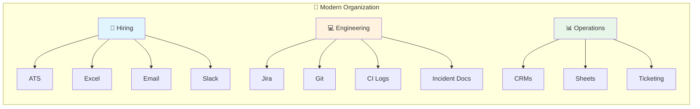

<details>
<summary>📋 <b>Example Complex Query</b> (click to expand)</summary>

<br/>

> *"Who is the best developer to lead the new authentication project, with >3 years of relevant experience, good team feedback, and no critical open bugs?"*

**To answer this manually, someone must:**
1. Query multiple tools one by one
2. Stitch context together in their head
3. Justify the final choice without clear evidence

</details>

<br/>

### ❌ The Problem with Current Solutions

<table>
<tr>
<th>❌ Current Pain Points</th>
<th>❌ Existing Chatbot Limitations</th>
</tr>
<tr>
<td>

| Challenge | Description |
|-----------|-------------|
| 🔍 Manual Queries | Query multiple tools one by one |
| 🧠 Mental Stitching | Stitch context in your head |
| 📝 No Audit Trail | Justify choices without evidence |

</td>
<td>

| Limitation | Impact |
|------------|--------|
| Single DB only | Can't aggregate across tools |
| No entity resolution | Same person = different records |
| No decision context | Forgets past interactions |
| No explainability | Black-box answers |

</td>
</tr>
</table>

### ✅ MERIDIAN Solves This!

---

## 🚀 What MERIDIAN Does

<table>
<tr>
<td width="50%" valign="top">

### 🔗 Multi-Source Orchestration
One natural language question → parallel queries over multiple data sources (MongoDB, Jira, REST APIs, etc.).

</td>
<td width="50%" valign="top">

### 🆔 Entity Resolution
Unifies "John Smith" from ATS, `john.smith` from Jira, and `john_s` from Slack into a single canonical entity with confidence scores.

</td>
</tr>
<tr>
<td width="50%" valign="top">

### 🎛️ Constraint-Aware Reasoning
Applies constraints like "salary < 80k" or ">3 years experience" across *all* relevant sources and re-plans queries when constraints change.

</td>
<td width="50%" valign="top">

### 📊 Explainable Ranking
Returns a ranked list of options with an evidence trail: which data source contributed what, and how it affected the score.

</td>
</tr>
<tr>
<td colspan="2" align="center">

### 📚 Decision Logging & Learning
Logs decisions and later outcomes ("we hired John; performance excellent"), so the system can learn which signals predict good decisions.

</td>
</tr>
</table>

> ⚠️ **This is not a ChatGPT wrapper** — it is a **system for reasoning over messy, distributed operational data.**

### 🔄 Data Flow Overview

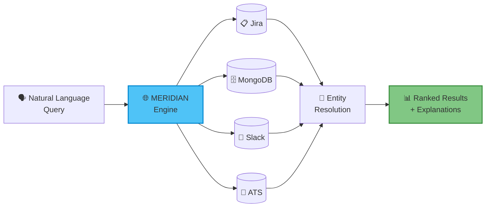

---

## 💡 Why It's Novel / Patent-Worthy

MERIDIAN's novelty is in **how** it reasons across heterogeneous sources, not in using an LLM per se.

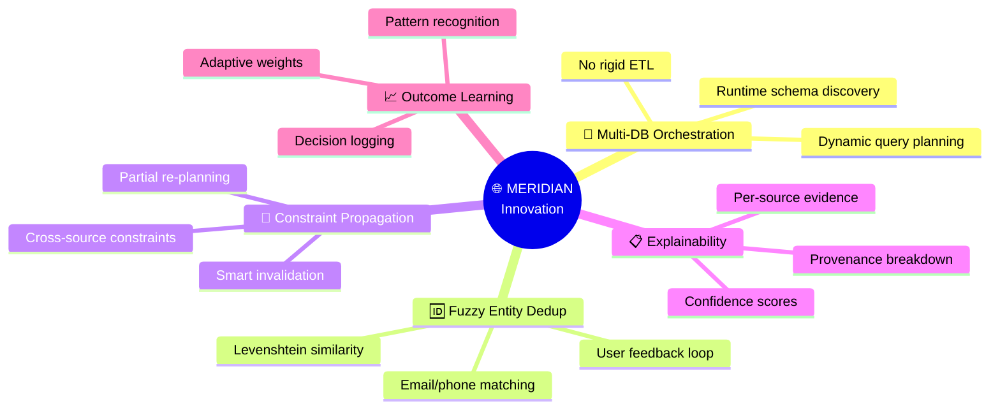

### 🏆 Key Innovations

| # | Innovation | Description |
|:-:|------------|-------------|
| 1️⃣ | **Entity-agnostic multi-database orchestration** | Dynamic query planning over multiple, schema-divergent sources. No rigid ETL; uses adapters and schemas discovered at runtime. |
| 2️⃣ | **Fuzzy entity deduplication with feedback loop** | Uses name similarity (Levenshtein), email/phone, and metadata to map entities. Incorporates user corrections to improve future mappings. |
| 3️⃣ | **Cross-source constraint propagation** | A single constraint (e.g., "salary < 80k") propagates across all sources and only re-queries what actually changed. |
| 4️⃣ | **Explainability trace-back** | Every ranked option has a provenance breakdown: which fields from which source contributed to which criterion. |
| 5️⃣ | **Outcome-driven learning** | Decisions and outcomes are logged; ranking weights adapt to patterns that predict successful outcomes. |

> 📜 These innovations form the core of what could underpin a **patent claim**.

---

## 🏗️ High-Level Architecture

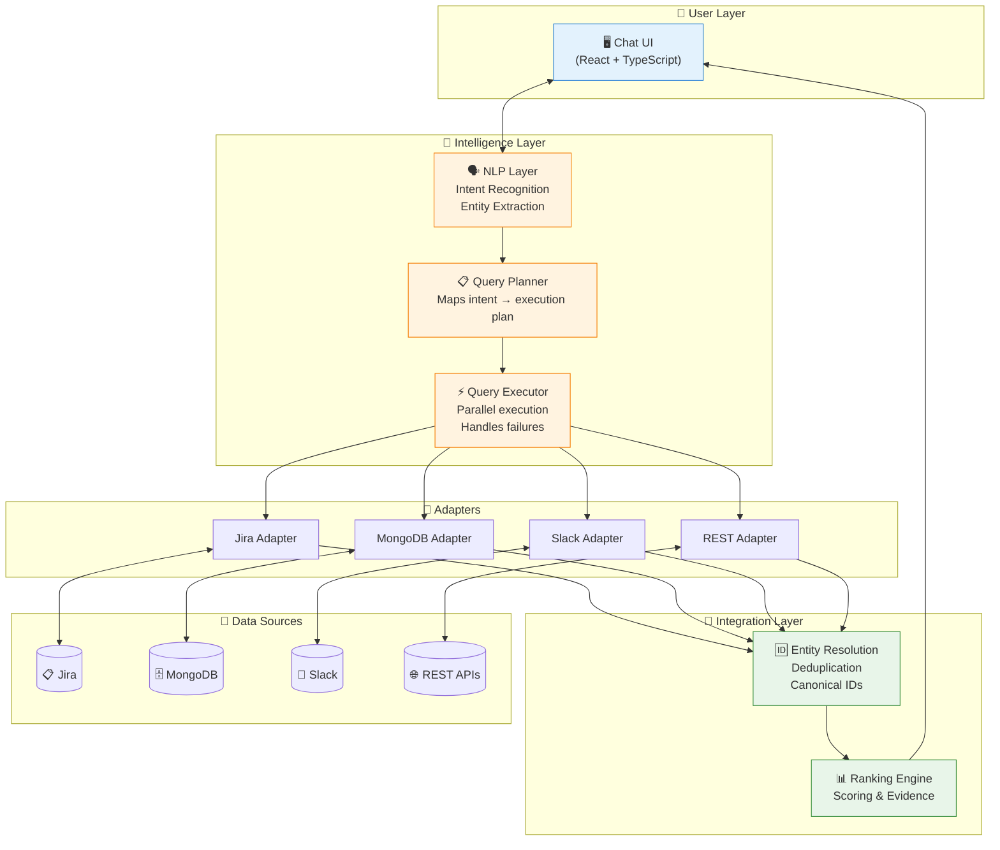

### 🛠️ Tech Stack

<table>
<tr>
<td align="center"><br/><b>React</b><br/>Frontend</td>
<td align="center"><br/><b>TypeScript</b><br/>Language</td>
<td align="center"><br/><b>Node.js</b><br/>Backend</td>
<td align="center"><br/><b>Express</b><br/>API</td>
<td align="center"><br/><b>MongoDB</b><br/>Database</td>
<td align="center"><br/><b>AI/LLM</b><br/>Abstracted</td>
</tr>
</table>

---

## ⭐ Core Features (MVP Scope)

### 📡 5.1 Source Configuration & Adapters

Each external system (Jira, internal Mongo, Airtable, generic REST) is represented as a **DataSource**:

```typescript
type SourceType = 'jira' | 'mongodb' | 'airtable' | 'rest' | 'slack';
```

<details>
<summary>📖 <b>Adapter Interface</b> (click to expand)</summary>

```typescript
interface SourceAdapter {
  connect(): Promise<void>;
  disconnect(): Promise<void>;
  getSchema(): Promise<Schema>;
  queryEntity(constraints: Constraint[], fields: string[]): Promise<Entity[]>;
  search(term: string, fields: string[]): Promise<Entity[]>;
  getEntity(id: string): Promise<Entity>;
}
```

</details>

> 🔌 This makes the AI layer **source-agnostic**.

---

### 🆔 5.2 Entity Resolution

**Goal:** Unify records across systems representing the same entity.

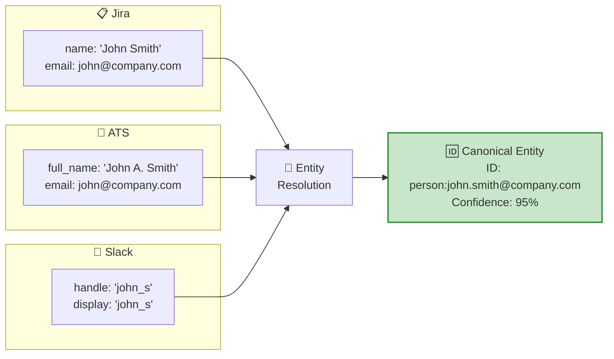

**Approach:**
- ✅ Levenshtein similarity on names
- ✅ Exact match on email/phone when available
- ✅ Threshold-based matching
- ✅ Persistent mappings with confidence scores

<details>
<summary>📖 <b>Entity Mapping Schema</b></summary>

```json
{
  "canonicalId": "person:john.smith@company.com",
  "mappings": {
    "jira-prod": "user-123",
    "ats": "cand-456",
    "slack": "U789"
  },
  "metadata": {
    "email": "john.smith@company.com",
    "name": "John Smith"
  },
  "confidence": 0.95
}
```

</details>

---

### 🔄 5.3 Multi-Source Query Orchestration

**Example Query:**
> "Show me developers who worked on authentication in the last 3 months, have no open P1 bugs, and salary < 80k."

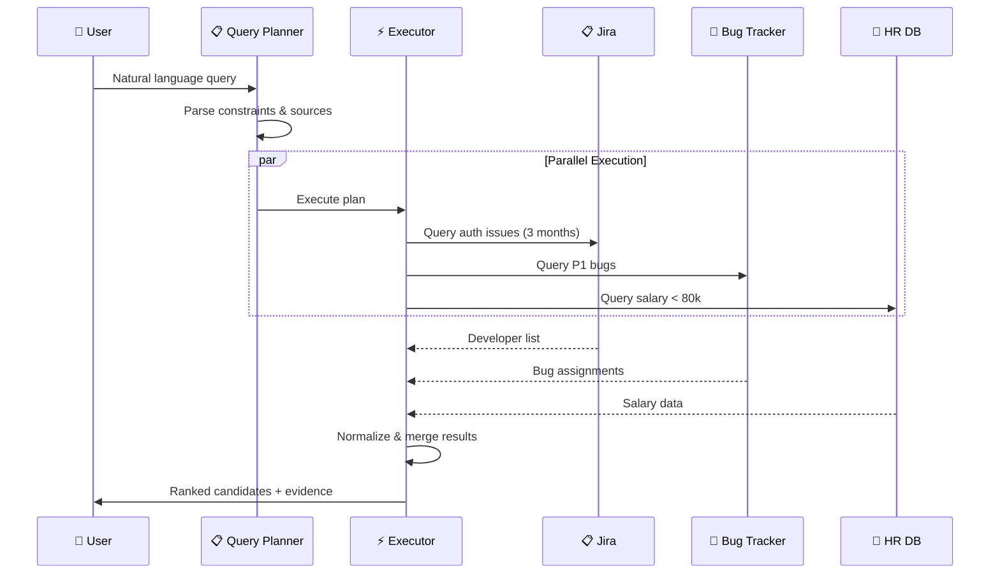

**Key Capabilities:**
| Feature | Description |
|---------|-------------|
| 🎯 Smart Planning | Determines relevant sources per constraint |
| ⚡ Parallel Execution | Queries all sources simultaneously |
| 🛡️ Fault Tolerance | Handles partial failures gracefully |

---

### 📊 5.4 Ranking & Explanation

Each option is scored across multiple criteria:

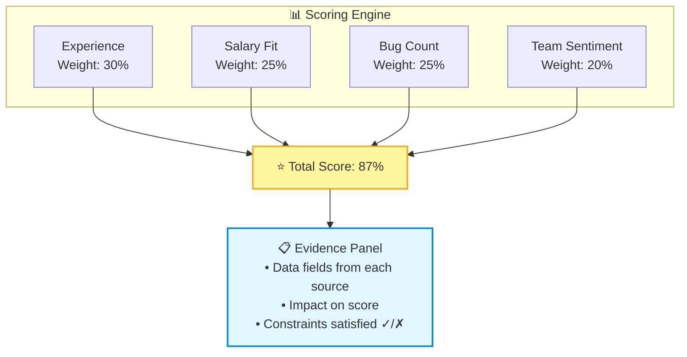

---

### 📝 5.5 Decision Logging & Learning

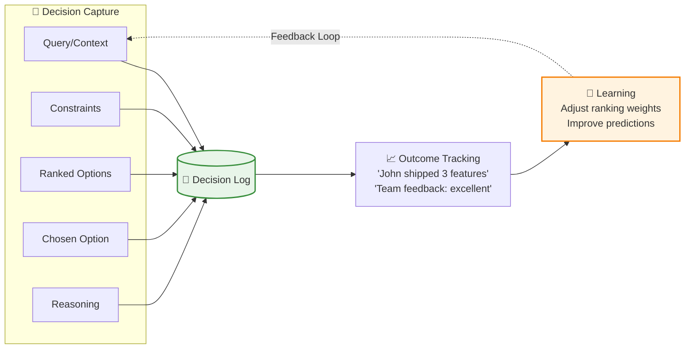

---

## 🗄️ Data Model (MongoDB – Sketch)

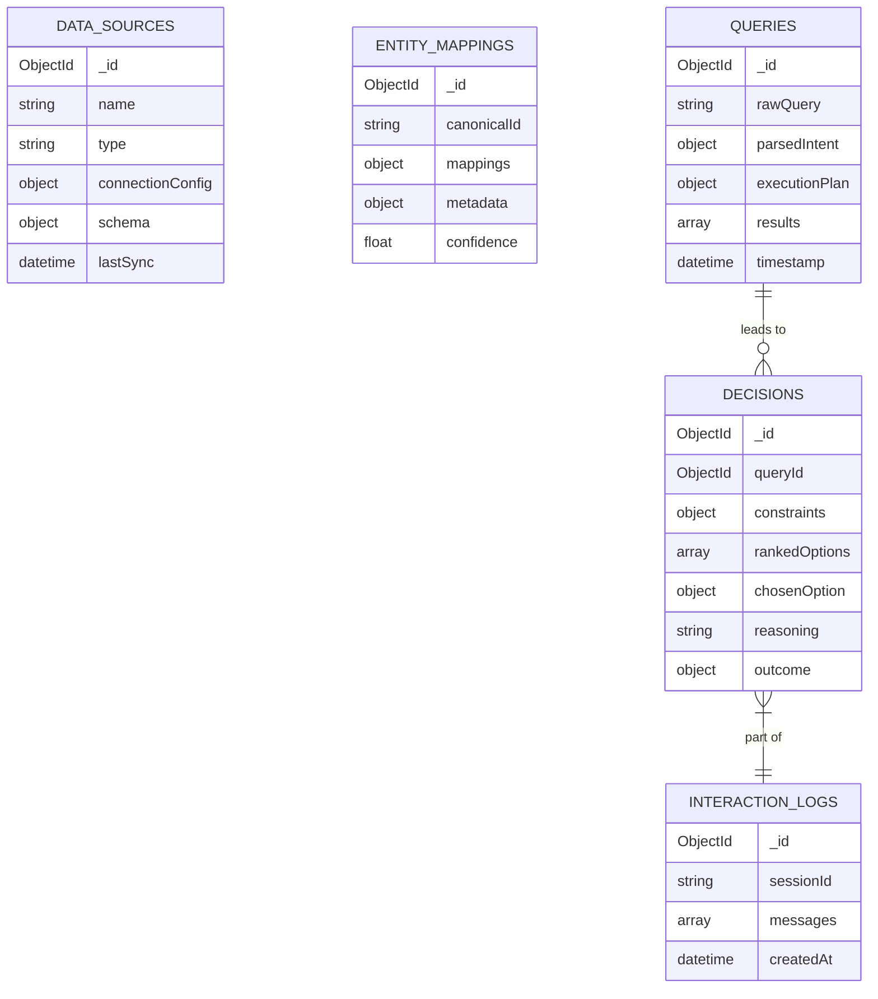

---

## 🖥️ Backend Responsibilities

**Node.js + Express + TypeScript**

### 🔌 API Endpoints

| Endpoint | Method | Description |
|----------|--------|-------------|
| `/api/sources` | GET, POST, PUT, DELETE | CRUD for data sources |
| `/api/chat/query` | POST | Main chat endpoint |
| `/api/decisions` | GET, POST | Decision logging |
| `/api/entities` | GET | Entity resolution info |

### 🏗️ Core Services

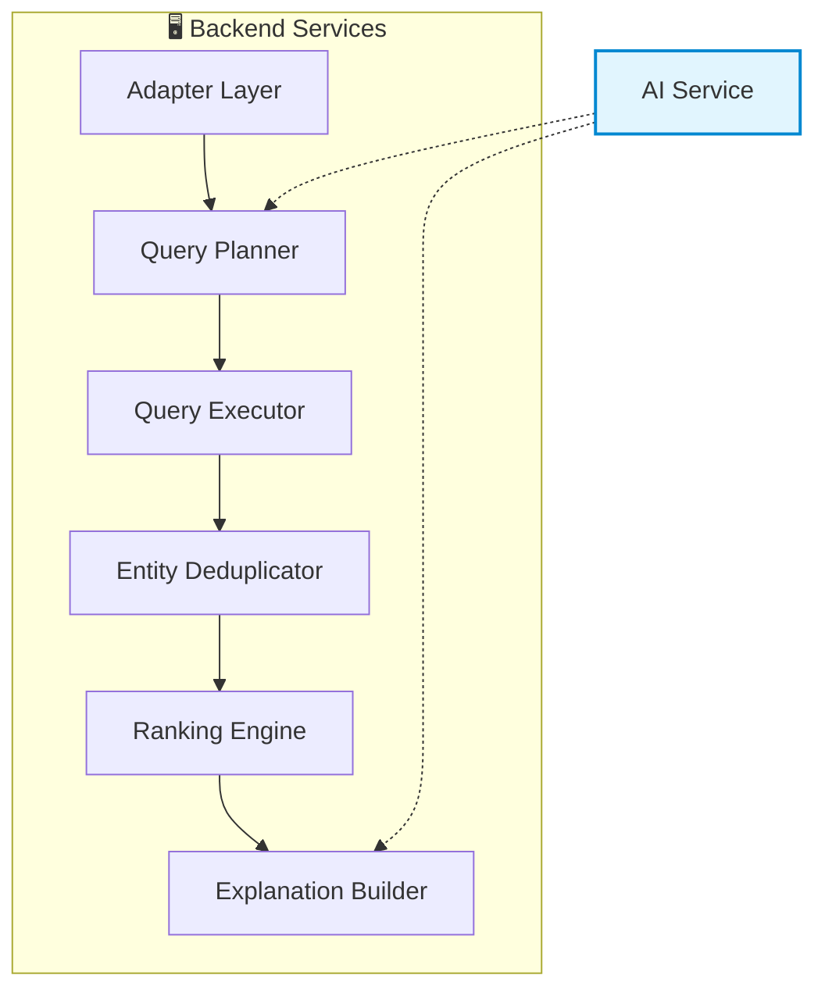

### 🔐 Security & Infrastructure

| Feature | Implementation |
|---------|----------------|
| 🔑 Authentication | JWT-based auth |
| 🔒 API Keys | Encrypted storage |
| 🛡️ Rate Limiting | Express middleware |
| 📊 Observability | Logging & metrics |

---

## 🎨 Frontend Responsibilities

**React + TypeScript**

### 📐 UI Components

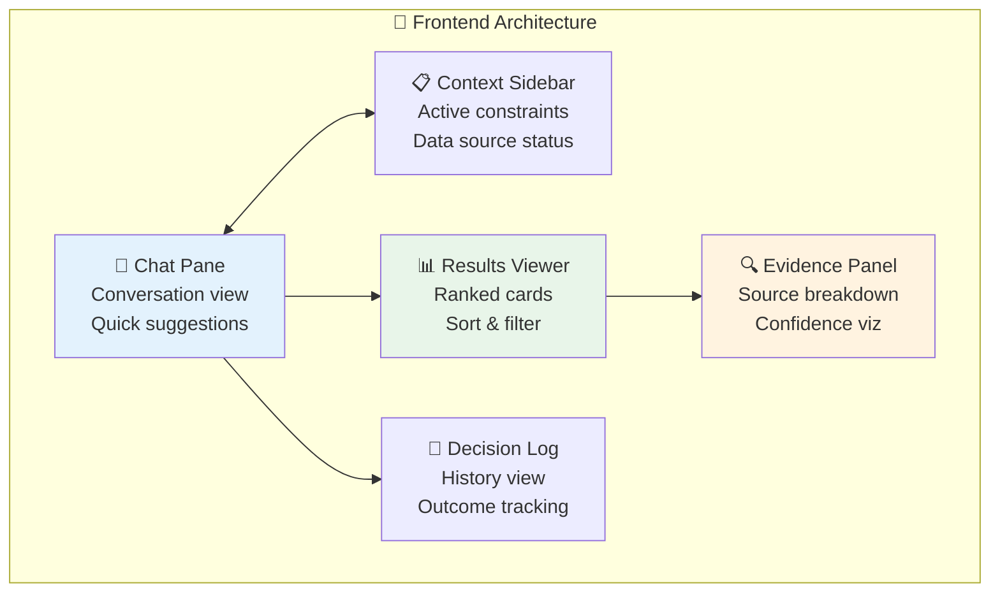

### 🎯 UI/UX Goals

<table>
<tr>
<td>🎨 <b>Glassmorphism</b></td>
<td>Modern, translucent UI elements</td>
</tr>
<tr>
<td>✨ <b>Smooth Transitions</b></td>
<td>Fluid animations between states</td>
</tr>
<tr>
<td>🔄 <b>Motion Feedback</b></td>
<td>Subtle loading indicators during queries</td>
</tr>
<tr>
<td>📱 <b>Responsive</b></td>
<td>Works across desktop and tablet</td>
</tr>
</table>

---

## 📍 Feature Breakdown (Student / MVP Scope)

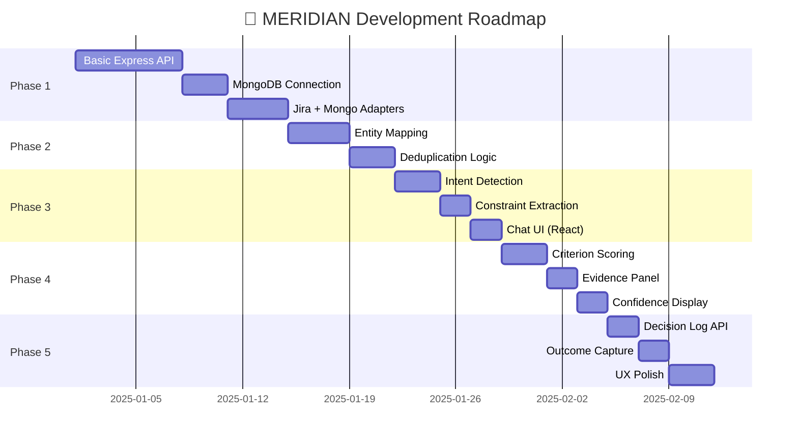

### 📋 Phase Details

<details>
<summary><b>🔹 Phase 1 (Weeks 1–2): Foundations</b></summary>

- ✅ Basic Express API
- ✅ MongoDB connection
- ✅ Simple Jira + Mongo adapter
- ✅ Hard-coded example query orchestrated across two sources

</details>

<details>
<summary><b>🔹 Phase 2 (Week 3): Entity Resolution</b></summary>

- ✅ Implement entity mapping & deduplication
- ✅ Store canonical IDs
- ✅ Show merged entities in API responses

</details>

<details>
<summary><b>🔹 Phase 3 (Week 4): Conversational Layer</b></summary>

- ✅ Simple intent detection (regex / heuristic)
- ✅ Constraint extraction (e.g., ">3 years", "<80k")
- ✅ Chat UI in React wired to backend

</details>

<details>
<summary><b>🔹 Phase 4 (Week 5): Ranking & Explainability</b></summary>

- ✅ Criterion-based scoring
- ✅ Evidence panel in UI
- ✅ Confidence display

</details>

<details>
<summary><b>🔹 Phase 5 (Week 6): Decision Logging & Polish</b></summary>

- ✅ Decision log API and UI
- ✅ Outcome capture
- ✅ Small UX refinements and performance tweaks

</details>

---

## 📜 What's Patentable Here?

<table>
<tr>
<th>Innovation</th>
<th>Description</th>
<th>Patent Relevance</th>
</tr>
<tr>
<td>🔄 <b>Multi-source orchestration protocol</b></td>
<td>How user intent is decomposed into per-source query plans and recomposed into a coherent answer</td>
<td>⭐⭐⭐⭐⭐</td>
</tr>
<tr>
<td>🆔 <b>Entity resolution + constraint propagation</b></td>
<td>Same canonical entity across systems with constraints that span sources</td>
<td>⭐⭐⭐⭐</td>
</tr>
<tr>
<td>📋 <b>Explainability trace-back</b></td>
<td>Consistent mechanism to map final ranked decisions back to per-source evidence with confidence</td>
<td>⭐⭐⭐⭐</td>
</tr>
<tr>
<td>📈 <b>Outcome-driven model adaptation</b></td>
<td>System that tunes its own ranking criteria based on historical decision outcomes</td>
<td>⭐⭐⭐⭐⭐</td>
</tr>
</table>

> 💼 Even if you don't file anything, this is **excellent interview and portfolio material**.

---

## ⚙️ Setup (Skeleton Instructions)

### 📦 Prerequisites

- Node.js v18+
- MongoDB (local or Atlas)
- npm or yarn

### 🖥️ Backend Setup

```bash
# Create and navigate to backend directory
mkdir backend && cd backend

# Initialize project
npm init -y

# Install dependencies
npm install express cors mongoose dotenv

# Install dev dependencies
npm install typescript ts-node-dev @types/node @types/express --save-dev

# Initialize TypeScript
npx tsc --init
```

<details>
<summary>📁 <b>Backend Structure</b></summary>

```
backend/
├── src/
│   ├── index.ts
│   ├── routes/
│   │   ├── sources.ts
│   │   ├── chat.ts
│   │   └── decisions.ts
│   ├── services/
│   │   ├── aiService.ts
│   │   ├── queryPlanner.ts
│   │   └── entityResolver.ts
│   ├── adapters/
│   │   ├── jiraAdapter.ts
│   │   ├── mongoAdapter.ts
│   │   └── slackAdapter.ts
│   ├── models/
│   │   └── ...
│   └── types/
│       └── ...
├── package.json
└── tsconfig.json
```

</details>

### 🎨 Frontend Setup

```bash
# Create React app with TypeScript
npx create-react-app frontend --template typescript

# Navigate to frontend
cd frontend

# Install dependencies
npm install axios
```

<details>
<summary>📁 <b>Frontend Structure</b></summary>

```
frontend/
├── src/
│   ├── components/
│   │   ├── ChatPane/
│   │   ├── ContextSidebar/
│   │   ├── ResultsViewer/
│   │   ├── EvidencePanel/
│   │   └── DecisionLog/
│   ├── hooks/
│   │   └── useChat.ts
│   ├── services/
│   │   └── api.ts
│   ├── types/
│   │   └── index.ts
│   ├── App.tsx
│   └── index.tsx
├── package.json
└── tsconfig.json
```

</details>

### 🚀 Quick Start

```bash
# Terminal 1: Start backend
cd backend
npm run dev

# Terminal 2: Start frontend
cd frontend
npm start
```

---

## 📄 License

This project is licensed under the MIT License - see the [LICENSE](LICENSE) file for details.

---

<div align="center">

**Made with ❤️ for intelligent decision-making**

[⬆ Back to Top](#-meridian)

</div>
